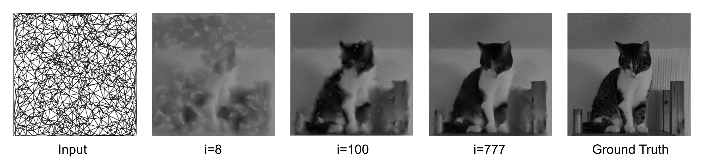

# Differentiable Triangulations

This is the implemenatation of the **Bachelor Thesis** _“Differentiable Triangulations through Smoothing in the Space of Weighted Delaunay Triangulations”_ . 

Triangulations are made differentiable by smoothing connectivity changes (flips) in the space of weighted Delaunay triangulations. The method enables gradient-based optimization of both vertex positions and mesh connectivity.



## Build and Run (Windows)

### Requirements 
- [CMake](https://cmake.org/) ≥ 3.12
- [Visual Studio 2022](https://visualstudio.microsoft.com/)
- [CGAL](https://www.cgal.org/) 
- [Eigen3](https://eigen.tuxfamily.org/)
- [OpenGL](https://learnopengl.com/) and [GLFW](https://www.glfw.org/)
The libraries **TinyAD** and **Polyscope** are included in this repository and do not require separate installation.

### Steps

```bash
git clone https://github.com/Jaminsel/differentiable-triangulations.git
cd differentiable-triangulations
cmake -B build -DCMAKE_BUILD_TYPE=Release
cmake --build build --config Release --parallel
.\build\bin\Release\WeightedTriangulationOptimization.exe
